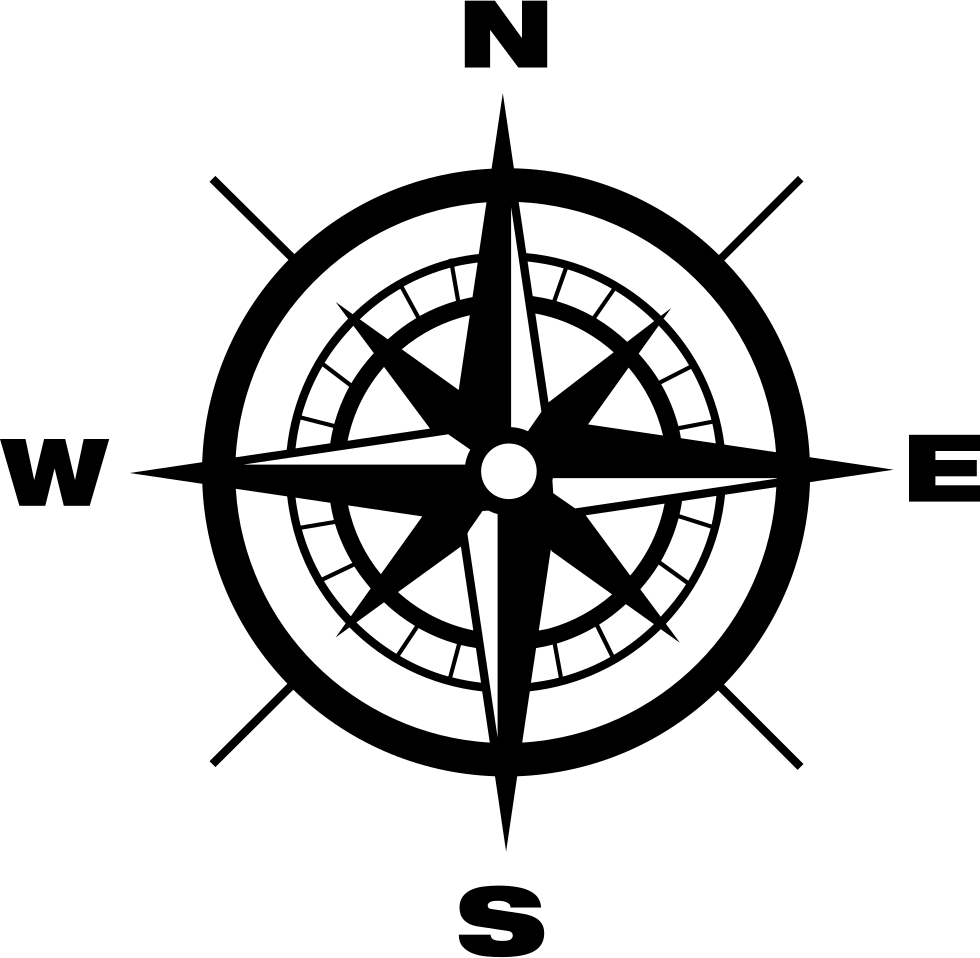
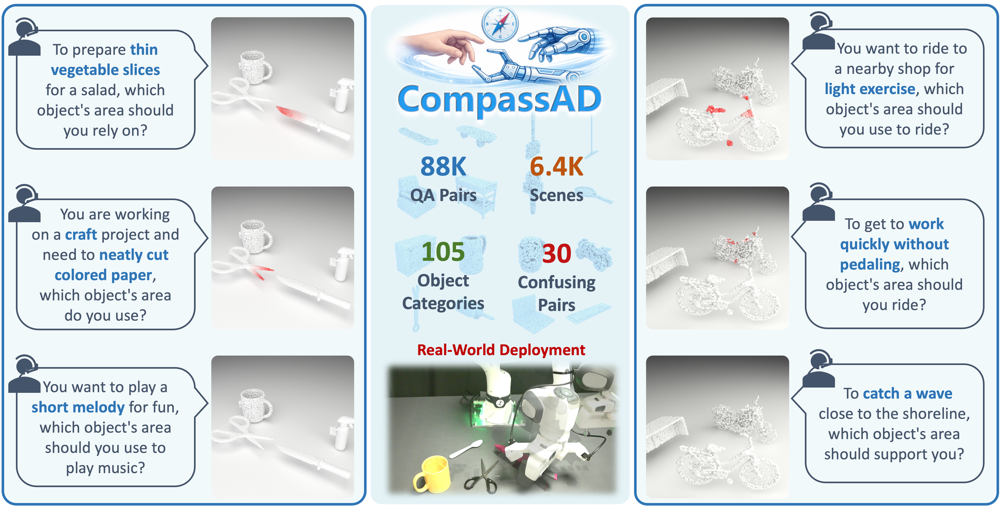
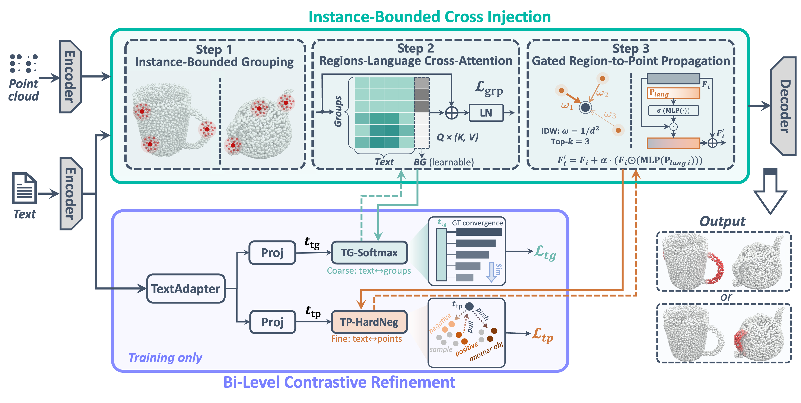
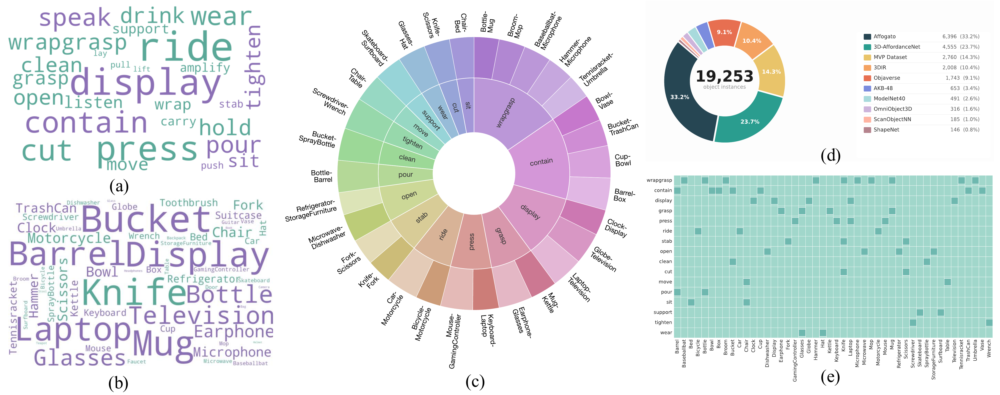
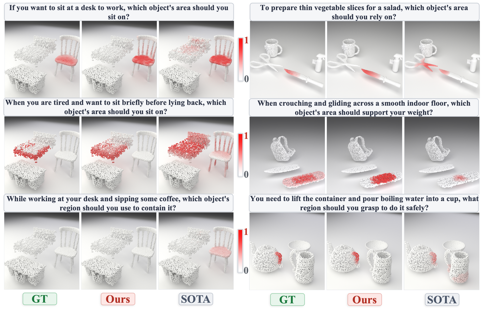
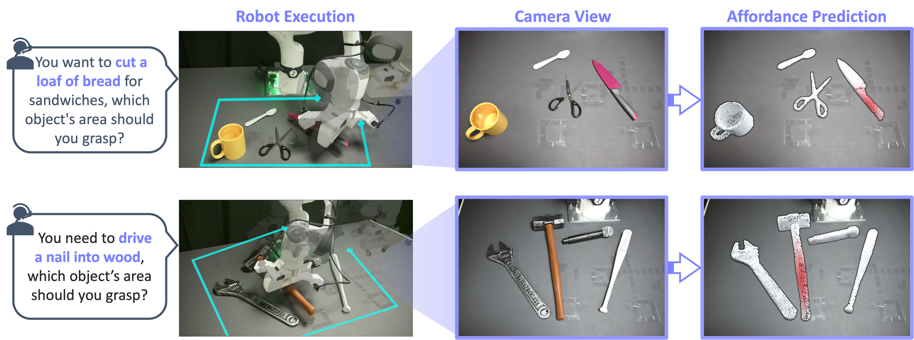

  

<h1 align="center">CompassAD: Intent-Driven 3D Affordance Grounding in Functionally Competing Objects</h1>

  
  
  
  

  <strong>Jingliang Li</strong>1,
  <a href="https://jiajindou.github.io/"><strong>Jindou Jia</strong></a>1,
  <a href="https://morpheus-an.github.io/"><strong>Tuo An</strong></a>1,
  <a href="https://chuhaozhou99.github.io/Chuhao-Zhou/"><strong>Chuhao Zhou</strong></a>1,
  <a href="https://xyc0212.github.io/"><strong>Xiangyu Chen</strong></a>1,
  <a href="https://shanshilin.github.io/"><strong>Shilin Shan</strong></a>1,
  <a href="https://ma-boyu.github.io/"><strong>Boyu Ma</strong></a>1,
  <strong>Bofan Lyu</strong>1,
  <a href="https://reagan1311.github.io/"><strong>Gen Li</strong></a>1,†,
  <a href="https://marsyang.site/"><strong>Jianfei Yang</strong></a>1,†

  1MARS Lab, Nanyang Technological University, Singapore

  †Corresponding Authors

  

<table align="center" width="88%">
  <tr>
    <td valign="top">
      <b>Abstract.</b> When told to "cut the apple," a robot must choose the knife over nearby scissors, despite both objects affording the same cutting function. In real-world scenes, multiple objects may share identical affordances, yet only one is appropriate under the given task context. We call such cases confusing pairs. However, existing 3D affordance methods largely sidestep this challenge by evaluating isolated single objects, often with explicit category names provided in the query. We formalize Multi-Object Affordance Grounding under Intent-Driven Instructions, a new 3D affordance setting that requires predicting a per-point affordance mask on the correct object within a cluttered multi-object point cloud, conditioned on implicit natural language intent. To study this problem, we construct CompassAD, the first benchmark centered on implicit intent in confusable multi-object scenes. It comprises 30 confusing object pairs spanning 16 affordance types, 6,422 scenes, and 88K+ query-answer pairs. Furthermore, we propose CompassNet, a framework that incorporates two dedicated modules tailored to this task. Instance-bounded Cross Injection (ICI) constrains language-geometry alignment within object boundaries to prevent cross-object semantic leakage. Bi-level Contrastive Refinement (BCR) enforces discrimination at both geometric-group and point levels, sharpening distinctions between target and confusable surfaces. Extensive experiments demonstrate state-of-the-art results on both seen and unseen queries, and deployment on a robotic manipulator confirms effective transfer to real-world grasping in confusing multi-object scenes.
        
      
      <b>Correspondence:</b> Jianfei Yang at <a href="mailto:jianfei.yang@ntu.edu.sg">jianfei.yang@ntu.edu.sg</a> &amp; Gen Li at <a href="mailto:gen.li@ntu.edu.sg">gen.li@ntu.edu.sg</a>
    </td>
  </tr>
</table>

---

## :gear: Method

  

**Overall architecture of CompassNet.** Given 3D point clouds of a scene and a human query, Uni3D and RoBERTa are applied to produce per-point features and text features. We then propose Instance-bounded Cross Injection (ICI), which enhances both region- and point-level representations through coarse-to-fine query interactions while preventing cross-object leakage of query semantics. Bi-level Contrastive Refinement (BCR) is further introduced to explicitly identify the functional regions that best match the query and provide additional supervision for highly ambiguous point-level affordances.

---

## :bar_chart: CompassAD Benchmark

  

---

## :art: Qualitative Comparison

  

---

## :robot: Real-World Robot Deployment

  

---

## :sparkles: More Qualitative Results

  

  

  

---

  <b>Code and dataset will be released soon. Stay tuned!</b>

