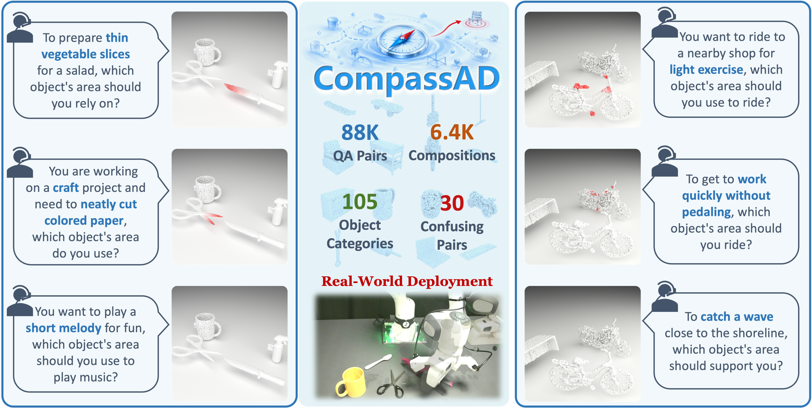
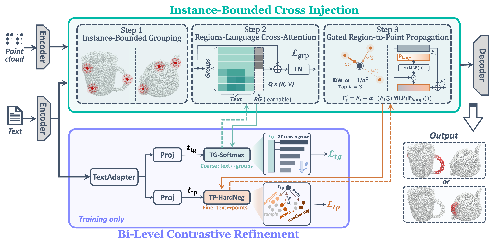

<h1 align="center"> CompassAD: Intent-Driven 3D Affordance Grounding<br />in Functionally Competing Objects</h1>

<p align="center">
  <a href="https://arxiv.org/abs/2604.02060"></a>
  <a href="https://lorenzo-0-0.github.io/CompassAD-Intent-Driven-3D-Affordance-Grounding-in-Functionally-Competing-Objects/"></a>
  <a href="https://github.com/Lorenzo-0-0/CompassAD-Intent-Driven-3D-Affordance-Grounding-in-Functionally-Competing-Objects"></a>
  
</p>

<p align="center">
  <strong>Jingliang Li</strong><sup>1</sup> &nbsp;&nbsp;
  <a href="https://jiajindou.github.io/"><strong>Jindou Jia</strong></a><sup>1</sup> &nbsp;&nbsp;
  <a href="https://morpheus-an.github.io/"><strong>Tuo An</strong></a><sup>1</sup> &nbsp;&nbsp;
  <a href="https://chuhaozhou99.github.io/Chuhao-Zhou/"><strong>Chuhao Zhou</strong></a><sup>1</sup>
  <br />
  <a href="https://xyc0212.github.io/"><strong>Xiangyu Chen</strong></a><sup>1</sup> &nbsp;&nbsp;
  <a href="https://shanshilin.github.io/"><strong>Shilin Shan</strong></a><sup>1</sup> &nbsp;&nbsp;
  <a href="https://ma-boyu.github.io/"><strong>Boyu Ma</strong></a><sup>1</sup> &nbsp;&nbsp;
  <strong>Bofan Lyu</strong><sup>1</sup> &nbsp;&nbsp;
  <a href="https://reagan1311.github.io/"><strong>Gen Li</strong></a><sup>1,†</sup> &nbsp;&nbsp;
  <a href="https://marsyang.site/"><strong>Jianfei Yang</strong></a><sup>1,†</sup>
</p>

<p align="center">
  <sup>1</sup>MARS Lab, Nanyang Technological University, Singapore
</p>

<p align="center">
  <sup>†</sup>Corresponding Authors
</p>

<p align="center">
  
</p>

<p align="center">
  <em>The proposed task of <b>Intent-Driven Confusable Affordance Grounding</b>. Given a multi-object point cloud and a natural language query describing an intended action, the goal is to predict a per-point affordance mask. The same composition can yield different targets depending on the query intent.</em>
</p>

<table align="center" width="88%">
  <tr>
    <td valign="top">
      <b>Abstract.</b> When told to "cut the cake," a robot must choose the knife over nearby scissors, despite both objects affording the same cutting function. In real-world scenes, multiple objects may share identical affordances, yet only one is appropriate under the given task context. We call such cases <em>confusing pairs</em>. However, existing 3D affordance methods largely sidestep this challenge by evaluating isolated single objects, often with explicit category names provided in the query. We formalize <b>Intent-Driven Confusable Affordance Grounding</b>, a new 3D affordance setting that requires predicting a per-point affordance mask on the correct object within a multi-object point cloud, conditioned on implicit natural language intent. To study this problem, we construct <b>CompassAD</b>, the first benchmark centered on implicit intent in confusing multi-object compositions. It comprises 30 confusing object pairs spanning 16 affordance types, 6,422 compositions, and 88K+ query-answer pairs. Furthermore, we propose <b>CompassNet</b>, a framework that incorporates two dedicated modules tailored to this task. <em>Instance-bounded Cross Injection</em> (ICI) constrains language-geometry alignment within object boundaries to prevent cross-object semantic leakage. <em>Bi-level Contrastive Refinement</em> (BCR) enforces discrimination at both geometric-group and point levels, sharpening distinctions between target and confusable surfaces. Extensive experiments demonstrate state-of-the-art results on both seen and unseen queries, and deployment on a robotic manipulator confirms effective transfer to real-world grasping in confusing multi-object compositions.
      <br /><br />
      
      <b>Correspondence:</b> Jianfei Yang at <a href="mailto:jianfei.yang@ntu.edu.sg">jianfei.yang@ntu.edu.sg</a> &amp; Gen Li at <a href="mailto:gen.li@ntu.edu.sg">gen.li@ntu.edu.sg</a>
    </td>
  </tr>
</table>

---

## :gear: Method

<p align="center">
  
</p>

**Overall architecture of CompassNet.** Given a multi-object point cloud and a natural-language query, Uni3D and RoBERTa produce per-point and text features. **Instance-bounded Cross Injection (ICI)** confines region–language interaction within each instance via (i) instance-bounded grouping, (ii) region-language cross-attention with a learnable background token, and (iii) gated propagation back to points — preventing cross-object semantic leakage by construction. **Bi-Level Contrastive Refinement (BCR)** adds two training-only contrastive losses: *TG-Softmax* ranks the in-object region that best matches the intent, while *TP-HardNeg* suppresses high-scoring negatives on confusable surfaces. BCR adds no parameters or computation at inference.

---

## :bookmark_tabs: Citation

If you find CompassAD useful in your research, please consider citing:

```bibtex
@article{Li2026CompassAD,
  title          = {CompassAD: Intent-Driven 3D Affordance Grounding in Functionally Competing Objects},
  author         = {Li, Jingliang and Jia, Jindou and An, Tuo and Zhou, Chuhao and
                    Chen, Xiangyu and Shan, Shilin and Ma, Boyu and Lyu, Bofan and
                    Li, Gen and Yang, Jianfei},
  year           = {2026},
  eprint         = {2604.02060},
  archivePrefix  = {arXiv},
  primaryClass   = {cs.CV}
}
```

---

<p align="center">
  <b>Code and dataset will be released soon. Stay tuned!</b>
</p>
